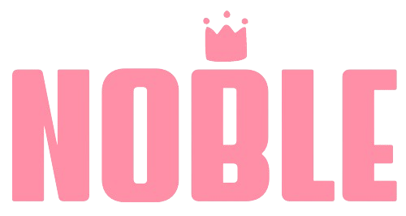
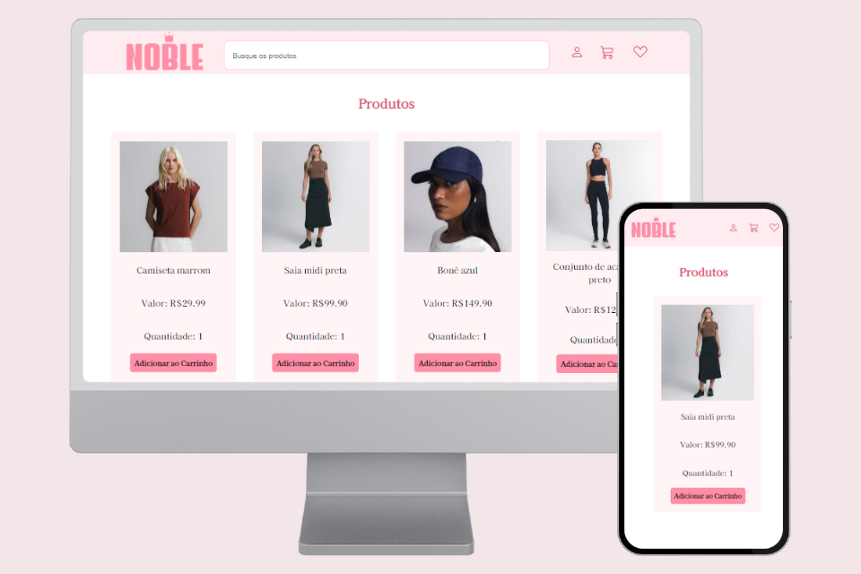

   

### Deploy --> <a href="https://brunacostaz.github.io/Noble/" text-align="center">Noble 🔗</a>

O Noble é um projeto feito, inicialmente, para o aprendizado da lógica por trás de um carrinho de compras funcional e o uso do LocalStorage. Resolvi desenvolver esse e-commerce para melhorar a experiência e gerar um propósito para o carrinho. 

Além disso, pretendo utilizar o Noble como meios de teste e consolidação dos conhecimentos e tecnologias em que eu estiver aprendendo. 

## 🛍️ Funcionalidades do projeto

- Adicionar produtos ao carrinho - clicando no botão "Adicionar ao carrinho" o produto será adicionado ao LocalStorage
- Notificação do carrinho - implementei uma notificação na qual, ao adicionar um produto ao carrinho, isso será contabilizado e o número de produtos será mostrado acima do ícone de carrinho, a fim de melhorar a UX
- Visualizar itens do carrinho - basta clicar no ícone do carrinho que o mesmo será aberto, com todos os produtos listados (imagem, texto descritivo, preço, quantidade e botão para remover produto).
- Adicionar mais itens do mesmo produto - quanto mais o botão de adicionar ao carrinho for clicado, maior será a quantidade do mesmo produto. O acréscimo da quantidade total e do valor total são feitos automaticamente
- Remover produtos - com o carrinho aberto, basta clicar no ícone de lixeira e o produto será removido
- Fechar carrinho - ao clicar no X, presente na parte superior esquerda do carrinho, o mesmo será fechado

## 🔨 Tecnologias utilizadas

- `HTML5 e CSS3`
- `JavaScript Vanilla`
- `LocalStorage`

  ## 🚀 Próximos passos

  Como falei anteriormente, o Noble é um projeto em que eu pretendo estar aprimorando conforme for aprendendo novas tecnologias:

  - Quero implemnetar uma forma melhor de adicionar novas quantidades de produtos, através de um select (ou outro input que eu achar melhor)
  - Vou migrar esse projeto para React e consumir dados de uma API, para preencher os produtos de maneira eficiente
  - Vou implementar SAAS e. talvez, Bootstrap para a estilização do Noble
  - Futuramente quero melhorar a responsividade do projeto, onde pretendo torná-lo Mobile First

